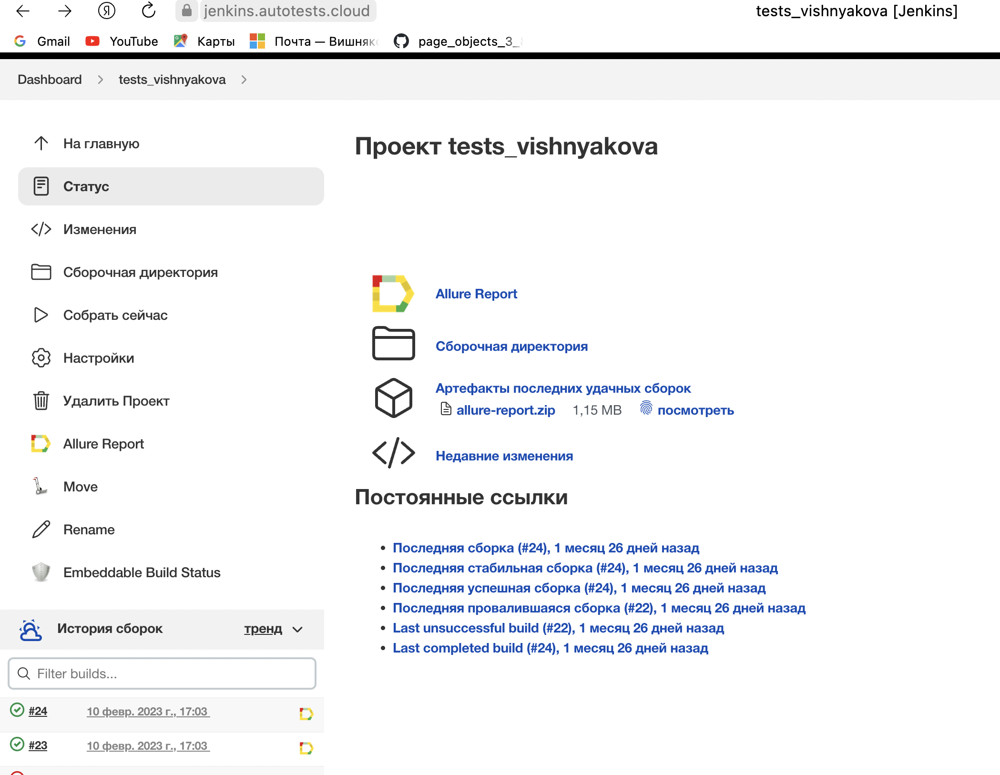
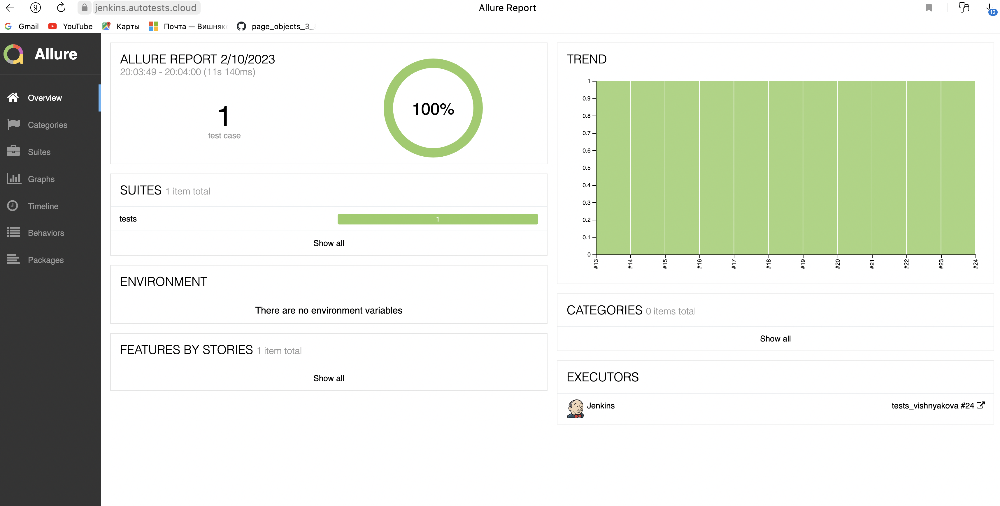
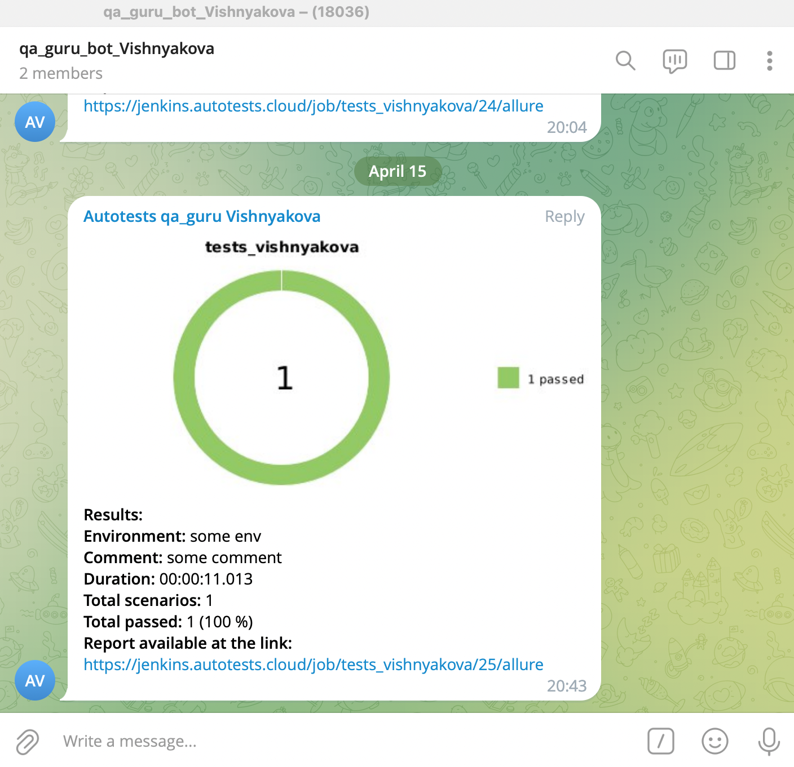

Проеĸт ui автотестов demo_tests_selene
===========

<!-- Технологии -->
### Технологии используемые в проеĸте

  <code></code>
  <code></code>
  <code></code>
  <code></code>
  <code></code>
  <code></code>
  <code></code>

### Что выполняет тест:
- Заполняет данные формы
- Отправляет заполненные данные
- Проверяет правильность заполненных данных

<!-- Jenkins -->

### Запуск проекта в Jenkins

### [Job](https://jenkins.autotests.cloud/job/tests_vishnyakova/)

##### При нажатии на "Собрать сейчас" начнется сборка тестов и их прохождение

<!-- Allure report -->

###  Allure report

##### После прохождения тестов, результаты автоматически сохраняются. Чтобы посмотреть Allure отчет нужно нажать на иконке allure report у сборки.

##### В Allure отчёте можно просмотреть видео прохождения теста

<!-- Telegram report -->

###  Telegram bot

##### После прохождения тестов, отчёт будет отправлен уведомлением в telegram чат

 
